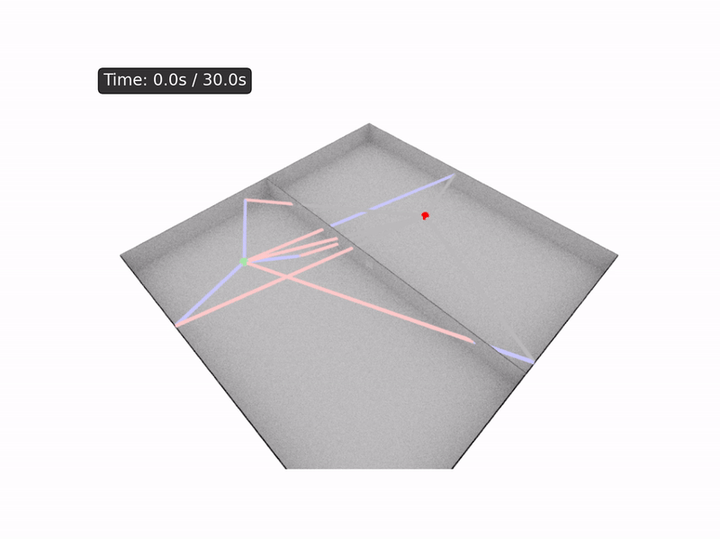
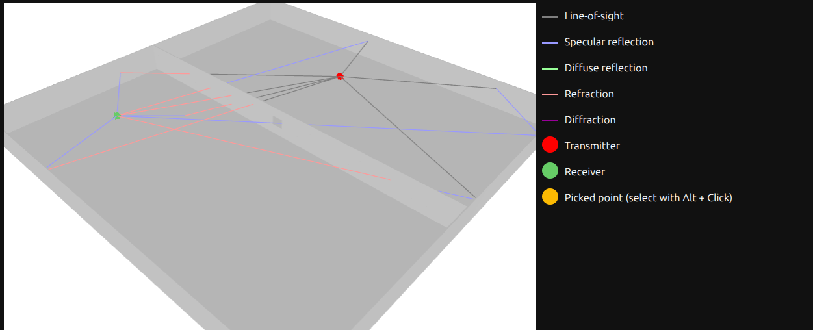
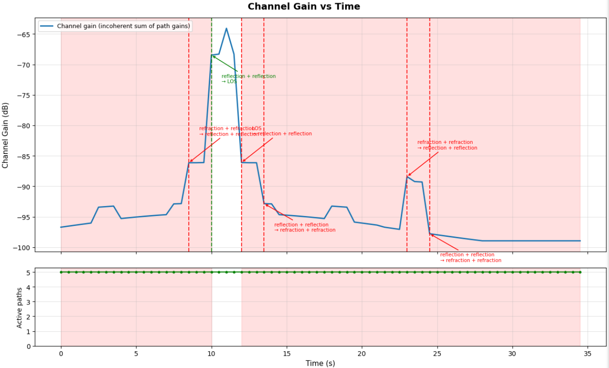

# SiNE - Sionna-based Network Emulation

## Table of Contents

- [Overview](#overview)
- [Features](#features)
- [Requirements](#requirements)
- [Installation](#installation)
- [Quick Start](#quick-start)
- [Example Networks and Topologies](#example-networks-and-topologies)
- [Creating Your Own Network](#creating-your-own-network)
- [Advanced Features](#advanced-features)
  - [Adaptive MCS Selection](#adaptive-mcs-selection)
  - [SINR and Interference Modeling](#sinr-and-interference-modeling)
  - [MANET Support](#manet-support)
  - [Node Mobility](#node-mobility)
  - [Real-Time Visualization](#real-time-visualization)
- [CLI Commands](#cli-commands)
- [Channel Server API](#channel-server-api)
- [Testing](#testing)
- [Debugging and Inspection](#debugging-and-inspection)
- [Collaboration](#-collaboration)
- [License](#license)

## Overview

SiNE (pronounced "SHEE-na") stands for **Si**onna **N**etwork **E**mulation. It lets you build emulated wireless networks with Docker containers as nodes, allowing you to deploy real applications on each node. It's built on the integration of several frameworks:

- **Containerlab**: Handles container deployment and network topology management
- **Nvidia Sionna v1.2.1**: Performs ray tracing and propagation modelling for wireless channel characterization
- **Linux netem**: Applies the computed channel conditions (delay, jitter, loss, bandwidth) to the links



*Sionna ray-traces propagation paths in real time as a client node walks past a doorway between two rooms. The AP is fixed in one room while the client starts moving until it aligns with the doorway (giving a LOS propagation path), then continues past. See [Example 5](examples/for_user/05_moving_node/) for a full walkthrough.*

## Features

- **Two link types**: Wireless (Sionna ray-traced) or Fixed netem (direct parameter control)
- **Two MANET modes**: Point-to-point veth pairs or Shared bridge (true broadcast medium)
- **Adaptive MCS selection**: WiFi 6-style SNR-based switching across BPSK → 1024-QAM with LDPC/Polar/Turbo FEC
- **SINR and interference modeling**: Co-channel and adjacent-channel interference with IEEE 802.11ax ACLR filtering
- **MAC protocol support**: TDMA (slot-weighted throughput) and CSMA/CA (carrier-sense) interference modeling
- **Indoor/outdoor scenes**: Mitsuba XML ray tracing with ITU material naming
- **Real-time mobility**: Position updates trigger live channel recomputation and netem updates
- **Live visualization**: Jupyter notebook viewer with 3D scene, propagation paths, and channel metrics

## Requirements

- Python 3.12+
- Docker
- Containerlab (installed via `./configure.sh`)
- Sionna v1.2.1 (installed automatically via `uv sync`)
- Linux kernel 4.2+ (for tc flower filters in shared bridge mode)
- sudo access (required for netem)
- Optional: NVIDIA GPU with CUDA (use `./configure.sh --cuda`)

## Installation

### 1. System Dependencies

```bash
# Basic setup (installs Containerlab)
./configure.sh

# With GPU support (installs NVIDIA CUDA Toolkit)
./configure.sh --cuda
```

### 2. Python Dependencies

```bash
# Install dependencies (creates venv, installs Sionna v1.2.1)
uv sync

# Development dependencies
uv sync --extra dev
```

## Quick Start

Deploy a simple point-to-point WiFi link between two nodes with adaptive MCS (WiFi 6). Run all commands from the **SiNE root directory** — you'll need three terminals open.

**Terminal 1** — Start the channel server:
```bash
uv run sine channel-server
```

**Terminal 2** — Deploy the emulation:
```bash
UV_PATH=$(which uv) sudo -E $(which uv) run sine deploy examples/for_user/03_adaptive_wifi_link/network.yaml
```

**Terminal 3** — Test throughput:
```bash
docker exec -d clab-adaptive-wifi-link-03-node2 iperf3 -s
docker exec clab-adaptive-wifi-link-03-node1 iperf3 -c 10.0.0.2 -t 5
# Expected: ~480 Mbps (20m link, MCS 10, 1024-QAM)
```

When you're done, tear it down from Terminal 2:
```bash
UV_PATH=$(which uv) sudo -E $(which uv) run sine destroy examples/for_user/03_adaptive_wifi_link/network.yaml
```

More examples are described in the [Example Networks and Topologies](#example-networks-and-topologies) section.

**Why sudo?** Network emulation requires sudo to access container network namespaces via `nsenter` and configure `tc` with netem. Without sudo, links operate at full bandwidth (~10+ Gbps) without wireless emulation.

## Example Networks and Topologies

A set of example networks and topologies can be found under the directory `examples/for_user/`. These examples form a natural progression — each isolating a specific SiNE capability. Examples 1→2 add co-channel interference to the same 3-node mesh. Examples 3→4 use the same 2-node P2P geometry, moving it indoors to show how Sionna models wall attenuation. Example 5 adds real-time mobility to the indoor scene.

| Example | Nodes | Scene | Key Feature |
|---------|-------|-------|-------------|
| [01_wireless_mesh/](examples/for_user/01_wireless_mesh/) | 3 (shared bridge mesh) | Free space | SNR drives MCS per link: 30m → MCS 10 (~480 Mbps), 91m → MCS 7 (~320 Mbps) |
| [02_co_channel_interference/](examples/for_user/02_co_channel_interference/) | 3 (same mesh as 01) | Free space | `enable_sinr: true` added — outer 91m links die at −3 dB SINR; surviving 30m link drops to ~50 Mbps |
| [03_adaptive_wifi_link/](examples/for_user/03_adaptive_wifi_link/) | 2 (AP + client, P2P) | Free space | 1024-QAM at 20m (~480 Mbps); change node position in YAML to watch MCS degrade |
| [04_through_the_wall/](examples/for_user/04_through_the_wall/) | 2 (same geometry as 03) | Two rooms | Concrete wall between nodes — SNR drops 15-20 dB vs Example 3, MCS falls to 64-QAM or lower |
| [05_moving_node/](examples/for_user/05_moving_node/) | 2 (AP fixed, client moves) | Two rooms | Client walks through doorway; throughput rises from ~50 Mbps to 300+ Mbps as LOS path opens |

## Creating Your Own Network

SiNE lets you create your own wireless networks by defining a scene (the physical environment) and a topology file (your nodes and links). Here's how to get started.

### 1. Create a Scene File (Optional)

SiNE uses Mitsuba XML to describe the physical environment for Sionna ray tracing. You can:

- Start with one of the ready-made scenes in `scenes/` — use `scenes/vacuum.xml` for free-space propagation
- Build your own scene in Mitsuba XML — materials must use ITU naming (e.g. `itu_concrete`, `itu_glass`)
- Skip the scene entirely if you're only using fixed netem links

### 2. Create a Network Topology (`network.yaml`)

Your topology file describes the nodes, their wireless interfaces, and how they connect. Here's a minimal two-node example:

```yaml
name: my-network

topology:
  enable_sinr: false

  scene:
    file: scenes/vacuum.xml

  nodes:
    node1:
      kind: linux
      image: alpine:latest
      exec:
        - apk add --no-cache iproute2 iputils iperf3
      interfaces:
        eth1:
          ip_address: 192.168.1.1/24
          wireless:
            position:
              x: 0
              y: 0
              z: 1
            frequency_ghz: 5.18
            bandwidth_mhz: 80
            rf_power_dbm: 20.0
            rx_sensitivity_dbm: -80.0
            antenna_pattern: hw_dipole
            polarization: V
            mcs_table: examples/common_data/wifi6_mcs.csv
            mcs_hysteresis_db: 2.0

    node2:
      kind: linux
      image: alpine:latest
      exec:
        - apk add --no-cache iproute2 iputils iperf3
      interfaces:
        eth1:
          ip_address: 192.168.1.2/24
          wireless:
            position:
              x: 20
              y: 0
              z: 1
            frequency_ghz: 5.18
            bandwidth_mhz: 80
            rf_power_dbm: 20.0
            rx_sensitivity_dbm: -80.0
            antenna_pattern: hw_dipole
            polarization: V
            mcs_table: examples/common_data/wifi6_mcs.csv
            mcs_hysteresis_db: 2.0

  links:
    - endpoints: [node1:eth1, node2:eth1]
```

**A few things to keep in mind:**
- Enable `enable_sinr: true` if you want co-channel interference modeled across nodes; leave it `false` for SNR-only
- Every interface needs either `wireless` or `fixed_netem` parameters — both endpoints of a link must use the same type
- For antennas, use **either** `antenna_pattern` (e.g. `iso`, `hw_dipole`) **or** `antenna_gain_dbi` — never both, to avoid double-counting Sionna's built-in pattern gains
- For modulation, use **either** `mcs_table` (adaptive MCS) **or** explicit `modulation`/`fec_type`/`fec_code_rate` parameters

The above YAML is also saved as [`examples/for_user/00_minimal_p2p/network.yaml`](examples/for_user/00_minimal_p2p/network.yaml) — run `uv run sine validate examples/for_user/00_minimal_p2p/network.yaml` to confirm it passes validation.

Take a look at `examples/for_user/` for complete reference topologies.

### 3. Deploy and Test

```bash
# Start channel server
uv run sine channel-server

# Deploy emulation
UV_PATH=$(which uv) sudo -E $(which uv) run sine deploy path/to/network.yaml

# Run your applications
docker exec -it clab-<topology>-<node> <command>

# Cleanup
UV_PATH=$(which uv) sudo -E $(which uv) run sine destroy path/to/network.yaml
```

## Advanced Features

### Adaptive MCS Selection

SiNE automatically picks the best modulation and coding scheme for current conditions, WiFi 6-style. Point it at an MCS table and it handles the rest:

```yaml
interfaces:
  eth1:
    wireless:
      mcs_table: examples/common_data/wifi6_mcs.csv
      mcs_hysteresis_db: 2.0  # Prevent rapid switching
      # ... other params
```

MCS table format:
```csv
mcs_index,modulation,code_rate,min_snr_db,fec_type,bandwidth_mhz
0,bpsk,0.5,5.0,ldpc,80
1,qpsk,0.5,8.0,ldpc,80
# ... up to 1024-QAM
```

See [examples/for_user/03_adaptive_wifi_link/](examples/for_user/03_adaptive_wifi_link/) for complete example.

### SINR and Interference Modeling

SiNE computes Signal-to-Interference-plus-Noise Ratio (SINR) for multi-node scenarios. When `enable_sinr: true` is set, SiNE automatically models co-channel interference from all other active nodes in the topology.

**How it works:**
1. Set `enable_sinr: true` at the topology level
2. SiNE identifies all other active nodes as potential interferers for each link
3. Interference power is computed based on path loss and node activity
4. MAC protocols (TDMA, CSMA/CA) control interference probability via transmission scheduling

**Interference features:**
- **Co-channel interference modeling**: Nodes on the same frequency interfere with each other
- **MAC protocol support**: TDMA and CSMA/CA control when nodes transmit, reducing interference impact
- **Per-interface control**: Use `is_active: false` to disable specific radios
- **Throughput modeling**: MAC protocols affect both interference probability and achievable throughput

**Basic SINR configuration:**

```yaml
topology:
  enable_sinr: true

  nodes:
    node1:
      interfaces:
        eth1:
          wireless:
            frequency_ghz: 5.18
            bandwidth_mhz: 80
            rf_power_dbm: 20.0
            antenna_pattern: hw_dipole

    node2:
      interfaces:
        eth1:
          wireless:
            frequency_ghz: 5.18
            bandwidth_mhz: 80
            rf_power_dbm: 20.0
            antenna_pattern: hw_dipole

    node3:
      interfaces:
        eth1:
          wireless:
            frequency_ghz: 5.18
            bandwidth_mhz: 80
            rf_power_dbm: 20.0
            antenna_pattern: hw_dipole
            is_active: true
```

In this co-channel scenario, SiNE automatically determines:
- For link node1↔node2: node3 is an interferer (same frequency)
- For link node1↔node3: node2 is an interferer (same frequency)
- For link node2↔node3: node1 is an interferer (same frequency)

**MAC protocol integration:**

MAC protocols control **when** nodes transmit, which affects both interference probability and network throughput.

**TDMA (Time Division Multiple Access):**

Nodes transmit in assigned time slots, reducing interference by avoiding simultaneous transmissions:

```yaml
nodes:
  node1:
    interfaces:
      eth1:
        wireless:
          frequency_ghz: 5.18
          tdma:
            enabled: true
            slot_probability: 0.2  # Transmits 20% of the time
```

- **Interference impact**: Interference weighted by `slot_probability` (20% transmission → 20% interference contribution)
- **Throughput impact**: Node's achievable throughput is PHY rate × slot_probability
- **Benefit**: Coordinated scheduling reduces collisions and interference

**CSMA/CA (Carrier Sense Multiple Access with Collision Avoidance):**

Nodes sense the channel before transmitting, avoiding simultaneous transmissions on busy channels:

```yaml
nodes:
  node1:
    interfaces:
      eth1:
        wireless:
          frequency_ghz: 5.18
          csma:
            enabled: true
            traffic_load: 0.3  # 30% duty cycle
            carrier_sense_range_multiplier: 2.5
```

- **Interference impact**: Transmission probability based on carrier sensing and network load
- **Throughput impact**: Contention and backoff reduce achievable throughput
- **Benefit**: Distributed coordination, no centralized scheduling needed

**No MAC protocol (worst-case):**

Without TDMA or CSMA/CA configuration, SiNE assumes worst-case interference (100% transmission probability). This represents scenarios where nodes transmit continuously (e.g., beacon-heavy networks, saturated channels).

See [02_co_channel_interference/](examples/for_user/02_co_channel_interference/) for a complete example — same 3-node mesh as Example 1 with `enable_sinr: true` added.

### MANET Support

SiNE supports two MANET modes — pick the one that fits your scenario:

**1. Point-to-Point Links (Default)**
- Each link is a separate veth pair with independent netem
- Simple, efficient, easy to debug
- Multiple interfaces per node

**2. Shared Bridge (True Broadcast Medium)**
- All nodes share a container-namespace Linux bridge
- Per-destination netem using HTB + tc flower filters
- Supports multiple interfaces per node (e.g., dual-band 2.4 GHz + 5 GHz)
- Supports MANET routing protocols (OLSR, BATMAN-adv, Babel)

```yaml
topology:
  shared_bridge:
    enabled: true
    name: manet-br0
    nodes: [node1, node2, node3]
    self_isolation_db: 30.0  # Coupling isolation between co-located radios (optional)
```

See [01_wireless_mesh/](examples/for_user/01_wireless_mesh/) (SNR only) and [02_co_channel_interference/](examples/for_user/02_co_channel_interference/) (with SINR) for complete shared bridge examples.

### Node Mobility

SiNE supports real-time node mobility — move a node and the channel is automatically recomputed and netem updated on all affected links. Position updates are sent via a REST control API running on port 8002, and SiNE polls for changes every 100 ms by default. Deploy with `--enable-control` to activate it:

```bash
UV_PATH=$(which uv) sudo -E $(which uv) run sine deploy --enable-control examples/for_user/05_moving_node/network.yaml
```

See [05_moving_node/](examples/for_user/05_moving_node/) for a complete walkthrough, including mobility scripts for linear, circular, and random-walk movement.

### Real-Time Visualization

Want to see what's happening inside your network as it runs? SiNE includes a live Jupyter viewer with 3D scene rendering, propagation paths, and channel metrics:

```bash
# 1. Start channel server
uv run sine channel-server

# 2. Deploy emulation (Example 5 is ideal — indoor scene + mobility)
UV_PATH=$(which uv) sudo -E $(which uv) run sine deploy --enable-control examples/for_user/05_moving_node/network.yaml

# 3. Open live viewer (browser-based Jupyter)
uv run --with jupyter jupyter notebook scenes/viewer_live.ipynb
```

We recommend making a copy of [viewer_live.ipynb](./scenes/viewer_live.ipynb) before running — Jupyter notebooks can be tricky to reset mid-session. See [05_moving_node/](examples/for_user/05_moving_node/) for a complete walkthrough.


**What you'll see:**

Sionna ray-traces the scene in real time as the node moves, showing which propagation paths are active and how signal level changes:



*3D scene view from the live viewer — AP in Room 1 (left), client in Room 2 (right). Propagation paths (coloured lines) are updated by Sionna each time the client position changes. The direct path through the doorway appears when the client aligns with the opening.*



*Channel gain vs time as the client walks from y = 5 m to y = 38 m at 1 m/s. Channel gain is the incoherent sum of Sionna's per-path power coefficients (10·log₁₀(Σ|aᵢ|²)) — a dimensionless ratio in dB, not received power. The dominant propagation mode starts as `refraction + refraction` (the signal traversing the concrete dividing wall — one refraction entering, one exiting) then transitions to LOS as the client aligns with the doorway. The ~15–20 dB gain spike at the LOS transition drives adaptive MCS from 64-QAM up to 1024-QAM.*

**Important:** Run in standard Jupyter Notebook (browser), not VS Code's Jupyter extension.

## CLI Commands

All SiNE operations go through the `sine` CLI:

```bash
uv run sine deploy <topology.yaml>          # Deploy emulation
uv run sine destroy <topology.yaml>         # Destroy emulation
uv run sine status                          # Show running containers
uv run sine channel-server                  # Start channel server
uv run sine validate <topology.yaml>        # Validate topology
uv run sine render <topology.yaml> -o img   # Render scene
uv run sine info                            # System information
```

## Channel Server API

SiNE's channel server exposes a REST API on port 8000. You can call it directly for custom integrations or debugging:

| Endpoint | Method | Description |
|----------|--------|-------------|
| `/health` | GET | Health check with GPU status |
| `/scene/load` | POST | Load ray tracing scene |
| `/compute/link` | POST | Compute channel for single link |
| `/compute/links_snr` | POST | Compute channels for multiple links (SNR only, O(N)) |
| `/compute/links_sinr` | POST | Compute channels with interference (O(N²)) |
| `/compute/interference` | POST | Compute SINR with explicit TX/RX/interferers |
| `/visualization/state` | GET | Cached scene/path data for live viewer |
| `/debug/paths` | POST | Get detailed path info for debugging |

Example `POST /compute/interference` request:
```json
{
  "tx_node": "node2",
  "rx_node": "node1",
  "tx_position": {"x": 20, "y": 0, "z": 1},
  "rx_position": {"x": 0,  "y": 0, "z": 1},
  "tx_power_dbm": 20.0,
  "frequency_hz": 5.18e9,
  "bandwidth_hz": 80e6,
  "antenna_pattern": "hw_dipole",
  "interferers": [
    {
      "node_name": "node3",
      "position": {"x": 10, "y": 17.3, "z": 1},
      "tx_power_dbm": 20.0,
      "frequency_hz": 5.18e9,
      "bandwidth_hz": 80e6,
      "is_active": true
    }
  ]
}
```

## Testing

SiNE has unit tests (fast, no external dependencies) and integration tests (require sudo + a running containerlab). Install dev dependencies first:

```bash
# Install test dependencies
uv sync --extra dev

# Run unit tests (fast, no sudo)
uv run pytest tests/unit/ -s

# Run integration tests (requires sudo)
UV_PATH=$(which uv) sudo -E $(which uv) run pytest tests/integration/ -s

# Run all tests (integration tests require sudo)
UV_PATH=$(which uv) sudo -E $(which uv) run pytest -s
```

## Debugging and Inspection

### Inspecting the Generated Containerlab Topology

When you deploy a network, SiNE generates a pure containerlab YAML file that can be inspected:

**File**: `.sine_clab_topology.yaml` (in the same directory as your `network.yaml`)

This file contains the topology after stripping all SiNE-specific wireless and netem parameters. It shows exactly what gets passed to the `containerlab deploy` command.

**Lifecycle**:
- ✅ Created during `sine deploy`
- ✅ Available throughout the emulation session
- ❌ Deleted during `sine destroy`

**What's in this file**:
- Pure containerlab format (standard `kind`, `image`, `cmd`, etc.)
- Link endpoints in containerlab format: `endpoints: ["node1:eth1", "node2:eth1"]`
- No wireless parameters (position, frequency, RF power, antenna config, MCS)
- No fixed_netem parameters (delay, jitter, loss, rate)

**When to inspect**:
- Verify container configuration before deployment
- Debug containerlab deployment issues
- Understand the exact topology containerlab is creating
- Confirm interface naming matches expectations

**Example**:
```bash
# Deploy network
UV_PATH=$(which uv) sudo -E $(which uv) run sine deploy examples/for_user/01_wireless_mesh/network.yaml

# Inspect generated containerlab topology
cat examples/for_user/01_wireless_mesh/.sine_clab_topology.yaml

# File will exist until you destroy
UV_PATH=$(which uv) sudo -E $(which uv) run sine destroy examples/for_user/01_wireless_mesh/network.yaml
```

## 🤝 Collaboration

If you’re interested in collaborating on SiNE, please open an issue to reach out
or start a discussion describing your idea!

## License

Apache License 2.0. See [LICENSE](./LICENSE) for details.
